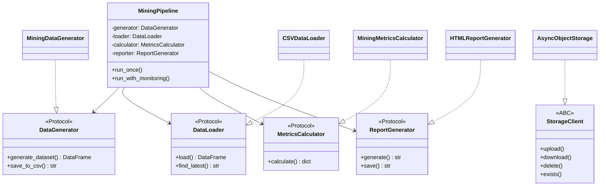

# 🏆 Mining Pipeline — Система анализа добычи золота гномами

[](https://www.python.org/downloads/)
[](https://selectel.ru/services/cloud/storage/)
[](#-solid-архитектура)

> **Data Engineering проект** для генерации, анализа и визуализации данных о добыче золота в сказочных шахтах гномов. Включает полный ETL-пайплайн с загрузкой отчетов в облачное хранилище Selectel S3. Архитектура соответствует SOLID-принципам.

---

## 📋 Содержание

- [🎯 Описание проекта](#-описание-проекта)
- [🏗️ Архитектура](#️-архитектура)
- [📁 Структура проекта](#-структура-проекта)
- [⚙️ Установка и настройка](#️-установка-и-настройка)
- [🚀 Запуск](#-запуск)
- [📦 Модули](#-модули)
- [🔷 SOLID-архитектура](#-solid-архитектура)
- [📊 Формат данных](#-формат-данных)
- [🎨 HTML-отчет](#-html-отчет)
- [☁️ Интеграция с Selectel S3](#️-интеграция-с-selectel-s3)

---

## 🎯 Описание проекта

Mining Pipeline — это полнофункциональная система для работы с данными о добыче золота в фантастическом мире гномов.

### Ключевые возможности:

| Функция | Описание |
|---------|----------|
| **Генерация данных** | Создание реалистичного датасета с 500+ гномами и 20+ шахтами |
| **Анализ данных** | Расчет KPI, рейтингов, эффективности смен |
| **HTML-отчеты** | Красивые интерактивные отчеты с адаптивным дизайном |
| **Облачное хранилище** | Асинхронная загрузка в Selectel S3 |
| **Мониторинг файлов** | Автоматическая обработка новых CSV-файлов |
| **SOLID-архитектура** | Dependency Injection, интерфейсы, разделение ответственностей |

---

## 🏗️ Архитектура



### Компоненты системы:

| Компонент | Класс | Интерфейс | Роль |
|-----------|-------|-----------|------|
| **Оркестратор** | `MiningPipeline` | — | Управление ETL-процессом |
| **Генератор** | `MiningDataGenerator` | `DataGenerator` | Создание данных |
| **Загрузчик** | `CSVDataLoader` | `DataLoader` | Загрузка CSV |
| **Калькулятор** | `MiningMetricsCalculator` | `MetricsCalculator` | Расчёт метрик |
| **Репортер** | `HTMLReportGenerator` | `ReportGenerator` | Генерация HTML |
| **S3-клиент** | `AsyncObjectStorage` | `StorageClient` | Операции с S3 |
| **Монитор** | `CSVFileMonitor` | `FileMonitor` | Отслеживание файлов |

---

## 📁 Структура проекта

```
de-internship-selectel/
├── 📄 pipeline.py           # Оркестратор с DI
├── 📄 interfaces.py         # Protocol/ABC интерфейсы
├── 📄 data_generation.py    # Генератор данных
├── 📄 analysis_report.py    # DataLoader + MetricsCalculator + ReportGenerator
├── 📄 async_s3_client.py    # S3-клиент (StorageClient)
├── 📄 monitoring.py         # Мониторинг файловой системы
├── 📄 report_uploader.py    # Загрузчик отчетов
├── 📄 config.py             # Конфигурация (пути, S3, генератор)
├── 📄 requirements.txt      # Python зависимости
├── 📄 .env                  # Переменные окружения
│
├── 📁 templates/            # HTML-шаблоны (OCP)
│   └── report_template.html
│
├── 📁 data/                 # CSV-файлы
├── 📁 reports/              # HTML-отчеты (временно)
├── 📁 archive/              # Архив отчетов
└── 📁 logs/                 # Логи операций
```

---

## ⚙️ Установка и настройка

### 1. Клонирование и виртуальное окружение

```bash
git clone <repository-url>
cd de-internship-selectel
python -m venv .venv
.venv\Scripts\activate  # Windows
pip install -r requirements.txt
```

### 2. Настройка переменных окружения

Создайте файл `.env`:

```ini
# S3 Configuration
S3_ACCESS_KEY=your_access_key
S3_SECRET_KEY=your_secret_key
S3_ENDPOINT=https://s3.ru-7.storage.selcloud.ru
S3_BUCKET=your_bucket_name

# Опционально: кастомные пути
DATA_DIR=./data
REPORTS_DIR=./reports
ARCHIVE_DIR=./archive
```

### Зависимости

| Пакет | Версия | Назначение |
|-------|--------|------------|
| `aiobotocore` | ≥2.5.0 | Асинхронный S3 клиент |
| `pandas` | ≥2.0.0 | Обработка данных |
| `numpy` | ≥1.24.0 | Численные вычисления |
| `faker` | ≥18.0.0 | Генерация fake-данных |
| `watchdog` | ≥3.0.0 | Мониторинг ФС |
| `python-dotenv` | ≥1.0.0 | Загрузка .env |

---

## 🚀 Запуск

### Однократный запуск

```bash
python pipeline.py
```

### Режим мониторинга

```bash
python pipeline.py --monitor
```

### С кастомными параметрами (DI)

```python
from pipeline import MiningPipeline
from data_generation import MiningDataGenerator

# Кастомный генератор с другими именами
custom_generator = MiningDataGenerator(
    name_prefixes=['Кастом', 'Имя'],
    name_suffixes=['Суффикс'],
    data_dir='./custom_data'
)

pipeline = MiningPipeline(
    data_generator=custom_generator,
    data_dir='./custom_data'
)

result = pipeline.run_once(num_gnomes=100, num_mines=5)
```

---

## 📦 Модули

### interfaces.py — Интерфейсы

Определяет контракты для всех компонентов:

```python
from typing import Protocol
from abc import ABC, abstractmethod

class DataGenerator(Protocol):
    def generate_dataset(self, ...) -> pd.DataFrame: ...
    def save_to_csv(self, ...) -> str: ...

class StorageClient(ABC):
    @abstractmethod
    async def upload(self, local_path: str, remote_path: str) -> str: ...
    @abstractmethod
    async def download(self, remote_path: str, local_path: str) -> str: ...
```

---

### analysis_report.py — Анализ данных (SRP)

Разделён на 3 класса согласно SRP:

| Класс | Ответственность |
|-------|-----------------|
| `CSVDataLoader` | Загрузка CSV файлов |
| `MiningMetricsCalculator` | Расчёт метрик |
| `HTMLReportGenerator` | Генерация HTML по шаблону |

```python
from analysis_report import CSVDataLoader, MiningMetricsCalculator, HTMLReportGenerator

loader = CSVDataLoader(data_dir='./data')
df = loader.load('mining_data.csv')

calculator = MiningMetricsCalculator()
metrics = calculator.calculate(df)

reporter = HTMLReportGenerator(template_path='./templates/report_template.html')
html = reporter.generate(metrics, df)
reporter.save(html, 'report.html')
```

---

### pipeline.py — Оркестратор (DIP)

Поддерживает Dependency Injection для всех компонентов:

```python
class MiningPipeline:
    def __init__(
        self, 
        data_generator=None,      # DI
        data_loader=None,         # DI
        metrics_calculator=None,  # DI
        report_generator=None,    # DI
        data_dir=None,            # Конфигурация
        reports_dir=None          # Конфигурация
    ):
        ...
```

---

### config.py — Конфигурация (OCP)

Расширяемая конфигурация:

```python
S3_CONFIG = {...}           # Настройки S3
PATHS_CONFIG = {...}        # Пути к директориям
GENERATOR_CONFIG = {        # Списки для генератора (OCP)
    'GNOME_PREFIXES': [...],
    'GNOME_SUFFIXES': [...],
    'LEGENDARY_MINES': [...],
}
```

---

## 🔷 SOLID-архитектура

### S — Single Responsibility

| До | После |
|----|-------|
| `MiningDataAnalyzer` = 5 задач | `CSVDataLoader` + `MiningMetricsCalculator` + `HTMLReportGenerator` |

### O — Open/Closed

- HTML-шаблон вынесен в `templates/report_template.html`
- Списки имён гномов/шахт в `config.py` — расширяемы без изменения кода

### L — Liskov Substitution

- `StorageClient` ABC — можно подставить любую реализацию (S3, LocalFS, Mock)

### I — Interface Segregation

5 узких Protocol-интерфейсов вместо одного большого класса.

### D — Dependency Inversion

```python
# До: жёсткие импорты
def generate_data(self):
    from data_generation import MiningDataGenerator  # ❌
    generator = MiningDataGenerator()

# После: DI через конструктор
pipeline = MiningPipeline(
    data_generator=custom_generator  # ✅
)
```

---

## 📊 Формат данных

CSV-датасет содержит 18 колонок:

| Колонка | Тип | Описание |
|---------|-----|----------|
| `gnome_name` | str | Имя гнома |
| `mine_name` | str | Название шахты |
| `gold_amount` | int | Добытое золото |
| `shift_duration_hours` | float | Длительность смены |
| `efficiency_gold_per_hour` | float | Эффективность |
| `ore_quality` | str | Качество руды |
| `event_in_mine` | str | Событие |
| ... | ... | ... |

---

## 🎨 HTML-отчет

Генерируется из шаблона `templates/report_template.html`:

- Сводные карточки с KPI
- Топ-5 продуктивных гномов
- Топ-5 шахт
- Доска позора (ленивые гномы)
- Адаптивный дизайн

---

## ☁️ Интеграция с Selectel S3

### StorageClient интерфейс

```python
class AsyncObjectStorage(StorageClient):
    async def upload(self, local_path: str, remote_path: str) -> str
    async def download(self, remote_path: str, local_path: str) -> str
    async def delete(self, remote_path: str) -> bool
    async def exists(self, remote_path: str) -> bool
    async def list_files(self, prefix: str) -> list[str]
```

### Тестирование с Mock

```python
class MockStorage(StorageClient):
    async def upload(self, local_path, remote_path):
        print(f"Mock upload: {local_path} -> {remote_path}")
        return remote_path

pipeline = MiningPipeline(storage_client=MockStorage())
```

---

## 📝 Логирование

- Все модули используют `logging`
- Файловые логи в `logs/upload_YYYY-MM-DD.log`
- Настройка вынесена в отдельную функцию `setup_file_logging()` (SRP)

---

## 📄 Лицензия

MIT License © 2024

---

> **Проект создан в рамках стажировки по Data Engineering в Selectel.**
