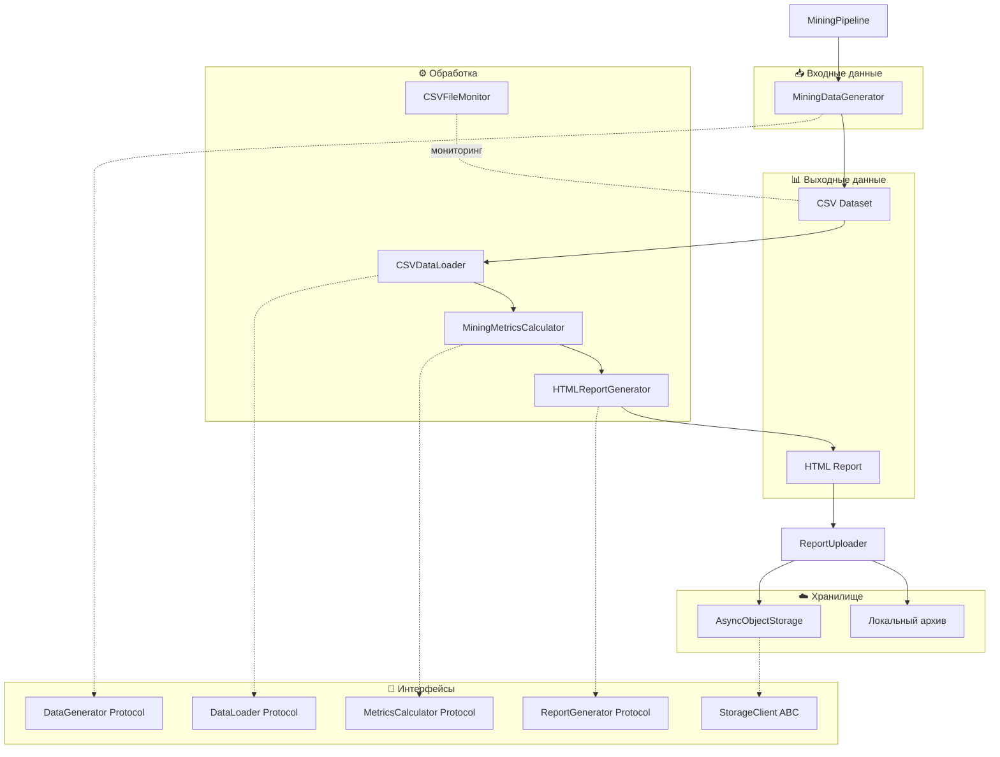
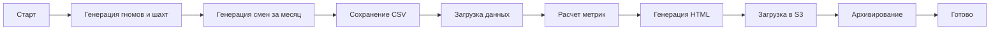
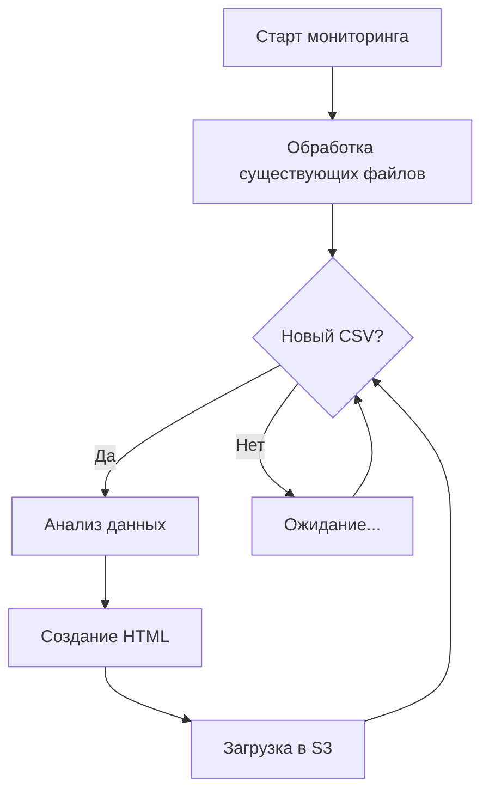

# 🏆 Mining Pipeline — Система анализа добычи золота гномами

[](https://www.python.org/downloads/)
[](https://selectel.ru/services/cloud/storage/)
[](https://github.com/aio-libs/aiobotocore)
[](#-solid-архитектура)

> **Data Engineering проект** для генерации, анализа и визуализации данных о добыче золота в сказочных шахтах гномов. Включает полный ETL-пайплайн с загрузкой отчетов в облачное хранилище Selectel S3. Архитектура соответствует принципам SOLID.

---

## 📋 Содержание

- [🎯 Описание проекта](#-описание-проекта)
- [🏗️ Архитектура](#️-архитектура)
- [📁 Структура проекта](#-структура-проекта)
- [⚙️ Установка и настройка](#️-установка-и-настройка)
- [🚀 Запуск](#-запуск)
- [📦 Модули](#-модули)
  - [interfaces.py — Интерфейсы](#interfacespy--интерфейсы)
  - [pipeline.py — MiningPipeline](#pipelinepy--miningpipeline)
  - [data_generation.py — MiningDataGenerator](#data_generationpy--miningdatagenerator)
  - [analysis_report.py — Анализаторы](#analysis_reportpy--анализаторы)
  - [async_s3_client.py — AsyncObjectStorage](#async_s3_clientpy--asyncobjectstorage)
  - [monitoring.py — CSVFileMonitor](#monitoringpy--csvfilemonitor)
  - [report_uploader.py — ReportUploader](#report_uploaderpy--reportuploader)
  - [config.py — Конфигурация](#configpy--конфигурация)
- [🔷 SOLID-архитектура](#-solid-архитектура)
- [🔄 Workflow пайплайна](#-workflow-пайплайна)
- [📊 Формат данных](#-формат-данных)
- [🎨 HTML-отчет](#-html-отчет)
- [☁️ Интеграция с Selectel S3](#️-интеграция-с-selectel-s3)
- [📝 Логирование](#-логирование)
- [📄 Лицензия](#-лицензия)

---

## 🎯 Описание проекта

Mining Pipeline — это полнофункциональная система для работы с данными о добыче золота в фантастическом мире гномов. Проект демонстрирует навыки Data Engineering:

### Ключевые возможности:

| Функция | Описание |
|---------|----------|
| **Генерация данных** | Создание реалистичного датасета с 500+ гномами и 20+ шахтами |
| **Анализ данных** | Расчет KPI, рейтингов, эффективности смен |
| **HTML-отчеты** | Красивые интерактивные отчеты с адаптивным дизайном |
| **Облачное хранилище** | Асинхронная загрузка в Selectel S3 |
| **Мониторинг файлов** | Автоматическая обработка новых CSV-файлов |
| **Архивирование** | Локальное архивирование обработанных отчетов |
| **SOLID-архитектура** | Интерфейсы, Dependency Injection, разделение ответственностей |

---

## 🏗️ Архитектура



### Компоненты системы:

| Компонент | Класс | Интерфейс | Роль |
|-----------|-------|-----------|------|
| **Оркестратор** | `MiningPipeline` | — | Управление ETL-процессом с DI |
| **Генератор** | `MiningDataGenerator` | `DataGenerator` | Создание синтетических данных |
| **Загрузчик** | `CSVDataLoader` | `DataLoader` | Загрузка CSV-файлов |
| **Калькулятор** | `MiningMetricsCalculator` | `MetricsCalculator` | Расчет метрик |
| **Репортер** | `HTMLReportGenerator` | `ReportGenerator` | Генерация HTML по шаблону |
| **S3-клиент** | `AsyncObjectStorage` | `StorageClient` | Базовые операции с S3 |
| **Загрузчик отчетов** | `ReportUploader` | — | Загрузка и архивирование |
| **Монитор** | `CSVFileMonitor` | `FileMonitor` | Отслеживание новых файлов |

---

## 📁 Структура проекта

```
de-internship-selectel/
├── 📄 pipeline.py           # Главный оркестратор с DI
├── 📄 interfaces.py         # Protocol/ABC интерфейсы
├── 📄 data_generation.py    # Генератор синтетических данных
├── 📄 analysis_report.py    # DataLoader + MetricsCalculator + ReportGenerator
├── 📄 async_s3_client.py    # Асинхронный S3 клиент (StorageClient)
├── 📄 monitoring.py         # Мониторинг файловой системы
├── 📄 report_uploader.py    # Загрузчик отчетов в S3
├── 📄 config.py             # Конфигурация (S3, пути, генератор)
├── 📄 requirements.txt      # Python зависимости
├── 📄 .env                  # Переменные окружения (секреты)
├── 📄 .gitignore            # Исключения Git
│
├── 📁 templates/            # HTML-шаблоны (OCP)
│   └── report_template.html
│
├── 📁 data/                 # CSV-файлы с данными
│   └── mining_data_YYYY_MM.csv
│
├── 📁 reports/              # HTML-отчеты (временно)
│   └── mining_report_Month_YYYY.html
│
├── 📁 archive/              # Архив обработанных отчетов
│   └── mining_report_Month_YYYY.html
│
└── 📁 logs/                 # Логи операций загрузки
    └── upload_YYYY-MM-DD.log
```

---

## ⚙️ Установка и настройка

### 1. Клонирование репозитория

```bash
git clone <repository-url>
cd de-internship-selectel
```

### 2. Создание виртуального окружения

```bash
python -m venv .venv

# Windows
.venv\Scripts\activate

# Linux/macOS
source .venv/bin/activate
```

### 3. Установка зависимостей

```bash
pip install -r requirements.txt
```

### 4. Настройка переменных окружения

Создайте файл `.env` в корне проекта:

```ini
# S3 Configuration
S3_ACCESS_KEY=your_access_key_here
S3_SECRET_KEY=your_secret_key_here
S3_ENDPOINT=https://s3.ru-7.storage.selcloud.ru
S3_BUCKET=your_bucket_name

# Опционально: кастомные пути
DATA_DIR=./data
REPORTS_DIR=./reports
ARCHIVE_DIR=./archive
LOGS_DIR=./logs
TEMPLATES_DIR=./templates
```

> ⚠️ **Важно:** Никогда не коммитьте файл `.env` с реальными ключами в репозиторий!

### Зависимости проекта

| Пакет | Версия | Назначение |
|-------|--------|------------|
| `aiobotocore` | ≥2.5.0 | Асинхронный клиент AWS S3 |
| `botocore` | ≥1.29.0 | Базовый клиент AWS |
| `pandas` | ≥2.0.0 | Обработка данных |
| `numpy` | ≥1.24.0 | Численные вычисления |
| `faker` | ≥18.0.0 | Генерация fake-данных |
| `watchdog` | ≥3.0.0 | Мониторинг файловой системы |
| `python-dotenv` | ≥1.0.0 | Загрузка переменных окружения |

---

## 🚀 Запуск

### Однократный запуск полного цикла

```bash
python pipeline.py
```

Выполняет:
1. Генерацию данных за последний месяц
2. Анализ и создание HTML-отчета
3. Загрузку отчета в Selectel S3
4. Архивирование локального файла

### Режим мониторинга

```bash
python pipeline.py --monitor
```

Запускает непрерывный мониторинг папки `data/`:
- Обрабатывает существующие CSV-файлы
- Следит за появлением новых файлов
- Автоматически создает отчеты и загружает их

### Отдельные модули

```bash
# Только генерация данных
python data_generation.py

# Только анализ и отчет
python analysis_report.py
```

### С кастомными зависимостями (DI)

```python
from pipeline import MiningPipeline
from data_generation import MiningDataGenerator
from analysis_report import CSVDataLoader, MiningMetricsCalculator, HTMLReportGenerator

# Кастомный генератор с другими именами
custom_generator = MiningDataGenerator(
    name_prefixes=['Кастом', 'Имя'],
    name_suffixes=['Суффикс'],
    data_dir='./custom_data'
)

# Кастомный загрузчик
custom_loader = CSVDataLoader(data_dir='./custom_data')

# Dependency Injection
pipeline = MiningPipeline(
    data_generator=custom_generator,
    data_loader=custom_loader,
    data_dir='./custom_data'
)

result = pipeline.run_once(num_gnomes=100, num_mines=5)
```

---

## 📦 Модули

### interfaces.py — Интерфейсы

**Определяет контракты** для всех компонентов системы (SOLID: ISP, DIP).

```python
from typing import Protocol
from abc import ABC, abstractmethod

class DataGenerator(Protocol):
    """Протокол для генератора данных"""
    def generate_dataset(self, num_gnomes: int, num_mines: int) -> pd.DataFrame: ...
    def save_to_csv(self, df: pd.DataFrame, filename: str) -> str: ...

class DataLoader(Protocol):
    """Протокол для загрузки данных"""
    def load(self, filepath: str) -> pd.DataFrame: ...
    def find_latest(self, directory: str) -> str: ...

class MetricsCalculator(Protocol):
    """Протокол для расчёта метрик"""
    def calculate(self, df: pd.DataFrame) -> dict: ...

class ReportGenerator(Protocol):
    """Протокол для генерации отчётов"""
    def generate(self, metrics: dict, df: pd.DataFrame) -> str: ...
    def save(self, content: str, filepath: str) -> str: ...

class StorageClient(ABC):
    """Абстрактный класс для клиентов хранилища"""
    @abstractmethod
    async def upload(self, local_path: str, remote_path: str) -> str: ...
    @abstractmethod
    async def download(self, remote_path: str, local_path: str) -> str: ...
    @abstractmethod
    async def delete(self, remote_path: str) -> bool: ...
    @abstractmethod
    async def exists(self, remote_path: str) -> bool: ...
```

---

### pipeline.py — MiningPipeline

**Главный оркестратор** всего ETL-процесса с поддержкой Dependency Injection.

```python
class MiningPipeline:
    """
    Управляет полным циклом обработки данных
    Поддерживает Dependency Injection для всех компонентов
    
    Режимы работы:
    - run_once(): Однократный запуск (генерация -> анализ -> загрузка)
    - run_with_monitoring(): Запуск с мониторингом папки data
    """
    
    def __init__(
        self, 
        data_generator=None,      # DI
        data_loader=None,         # DI
        metrics_calculator=None,  # DI
        report_generator=None,    # DI
        data_dir=None,
        reports_dir=None
    ): ...
```

#### Методы:

| Метод | Описание | Возвращает |
|-------|----------|------------|
| `__init__(...)` | Инициализация с DI | — |
| `generate_data(num_gnomes, num_mines)` | Генерация CSV-датасета | `str` — путь к файлу |
| `analyze_and_create_report(csv_path)` | Анализ и создание HTML | `str` — путь к отчету |
| `upload_to_storage(report_path)` | Асинхронная загрузка в S3 | `dict` — результат |
| `run_once(num_gnomes, num_mines)` | Полный однократный цикл | `dict` — результаты |
| `run_with_monitoring()` | Запуск с мониторингом | — |

---

### data_generation.py — MiningDataGenerator

**Генератор синтетических данных** о добыче золота с конфигурируемыми параметрами.

```python
class MiningDataGenerator:
    """
    Генерирует реалистичный датасет смен гномов за календарный месяц
    Поддерживает конфигурирование через параметры (OCP)
    """
    
    def __init__(
        self, 
        locale: str = 'ru_RU',
        data_dir: str = None,          # Конфигурируемый путь
        name_prefixes: list = None,    # Кастомные имена (OCP)
        name_suffixes: list = None,
        mine_types: list = None,
        legendary_mines: list = None
    ): ...
```

#### Алгоритм расчета добычи:

```python
# Итоговая добыча = базовая * множители
gold = base_gold_per_hour * shift_duration * (
    gnome_multiplier *      # Продуктивность гнома (0.1-3.5)
    mine_multiplier *       # Богатство шахты (0.5-3.5)
    day_factor *            # Усталость к концу месяца (0.8-1.1)
    event_multiplier *      # Случайные события (0.1-4.0)
    quality_multiplier      # Качество руды (0.1-2.0)
)
```

---

### analysis_report.py — Анализаторы

**Разделён на 3 класса** согласно SRP:

| Класс | Интерфейс | Ответственность |
|-------|-----------|-----------------|
| `CSVDataLoader` | `DataLoader` | Загрузка CSV файлов |
| `MiningMetricsCalculator` | `MetricsCalculator` | Расчет метрик |
| `HTMLReportGenerator` | `ReportGenerator` | Генерация HTML по шаблону |

```python
from analysis_report import CSVDataLoader, MiningMetricsCalculator, HTMLReportGenerator

# Использование отдельных компонентов
loader = CSVDataLoader(data_dir='./data')
df = loader.load('mining_data.csv')

calculator = MiningMetricsCalculator()
metrics = calculator.calculate(df)

reporter = HTMLReportGenerator(
    template_path='./templates/report_template.html',
    reports_dir='./reports'
)
html = reporter.generate(metrics, df)
reporter.save(html, 'report.html')
```

#### MiningDataAnalyzer (фасад)

Для обратной совместимости сохранён класс-фасад:

```python
class MiningDataAnalyzer:
    """Фасад с поддержкой Dependency Injection"""
    
    def __init__(
        self, 
        data_path: str = None,
        data_loader: CSVDataLoader = None,        # DI
        metrics_calculator: MiningMetricsCalculator = None,  # DI
        report_generator: HTMLReportGenerator = None         # DI
    ): ...
```

---

### async_s3_client.py — AsyncObjectStorage

**Асинхронный клиент S3**, реализующий интерфейс `StorageClient`.

```python
class AsyncObjectStorage(StorageClient):
    """
    Асинхронный клиент для работы с объектным хранилищем S3
    Реализует интерфейс StorageClient (LSP)
    """
```

#### Методы:

| Метод | Описание | Async |
|-------|----------|-------|
| `upload(local_path, remote_path)` | Загрузка файла в бакет | ✅ |
| `download(remote_path, local_path)` | Скачивание файла | ✅ |
| `delete(remote_path)` | Удаление файла | ✅ |
| `exists(remote_path)` | Проверка существования | ✅ |
| `list_files(prefix)` | Список файлов в бакете | ✅ |

---

### monitoring.py — CSVFileMonitor

**Монитор файловой системы** для отслеживания новых CSV-файлов.

```python
class CSVFileMonitor:
    """
    Использует библиотеку watchdog для событий файловой системы
    Поддерживает callback-функции для обработки файлов (OCP)
    """
```

---

### report_uploader.py — ReportUploader

**Загрузчик отчетов** в S3 с архивированием и конфигурацией через DI.

```python
class ReportUploader:
    """
    Асинхронный загрузчик отчетов в S3 хранилище
    Конфигурация через параметры конструктора (DIP)
    """
    
    def __init__(
        self,
        *,
        key_id: str,
        secret: str,
        endpoint: str,
        bucket: str,
        logs_dir: str = None,     # Опционально
        archive_dir: str = None   # Опционально
    ): ...
```

---

### config.py — Конфигурация

**Модуль конфигурации** с расширяемыми параметрами (OCP).

```python
# Конфигурация S3
S3_CONFIG = {
    'ACCESS_KEY': os.getenv('S3_ACCESS_KEY'),
    'SECRET_KEY': os.getenv('S3_SECRET_KEY'),
    'ENDPOINT': os.getenv('S3_ENDPOINT'),
    'BUCKET': os.getenv('S3_BUCKET')
}

# Конфигурация путей
PATHS_CONFIG = {
    'DATA_DIR': os.getenv('DATA_DIR', str(BASE_DIR / 'data')),
    'REPORTS_DIR': os.getenv('REPORTS_DIR', str(BASE_DIR / 'reports')),
    'ARCHIVE_DIR': os.getenv('ARCHIVE_DIR', str(BASE_DIR / 'archive')),
    'LOGS_DIR': os.getenv('LOGS_DIR', str(BASE_DIR / 'logs')),
    'TEMPLATES_DIR': os.getenv('TEMPLATES_DIR', str(BASE_DIR / 'templates')),
}

# Конфигурация генератора (OCP — расширяемые списки)
GENERATOR_CONFIG = {
    'GNOME_PREFIXES': [...],
    'GNOME_SUFFIXES': [...],
    'MINE_TYPES': [...],
    'LEGENDARY_MINES': [...],
}
```

---

## 🔷 SOLID-архитектура

### S — Single Responsibility Principle

| До рефакторинга | После рефакторинга |
|-----------------|-------------------|
| `MiningDataAnalyzer` = 5 задач | `CSVDataLoader` — загрузка |
| | `MiningMetricsCalculator` — метрики |
| | `HTMLReportGenerator` — отчёты |

### O — Open/Closed Principle

- ✅ HTML-шаблон вынесен в `templates/report_template.html`
- ✅ Списки имён гномов/шахт в `config.py` — расширяемы без изменения кода
- ✅ Callback-функции в `CSVFileMonitor`

### L — Liskov Substitution Principle

```python
# StorageClient ABC — можно подставить любую реализацию
class MockStorage(StorageClient):
    async def upload(self, local_path, remote_path):
        print(f"Mock upload: {local_path}")
        return remote_path

# Подстановка в тестах
pipeline = MiningPipeline(storage_client=MockStorage())
```

### I — Interface Segregation Principle

5 узких Protocol-интерфейсов вместо одного большого класса:
- `DataGenerator`
- `DataLoader`
- `MetricsCalculator`
- `ReportGenerator`
- `StorageClient`

### D — Dependency Inversion Principle

```python
# До: жёсткие импорты внутри методов
def generate_data(self):
    from data_generation import MiningDataGenerator  # ❌
    generator = MiningDataGenerator()

# После: DI через конструктор
pipeline = MiningPipeline(
    data_generator=custom_generator  # ✅
)
```

---

## 🔄 Workflow пайплайна

### Однократный запуск (`run_once`)



### Режим мониторинга (`run_with_monitoring`)



---

## 📊 Формат данных

### CSV-датасет

Генерируемый файл `mining_data_YYYY_MM.csv` содержит следующие колонки:

| Колонка | Тип | Описание |
|---------|-----|----------|
| `gnome_id` | int | ID гнома |
| `gnome_name` | str | Имя гнома (например, "Торин Каменная Борода") |
| `gnome_experience` | int | Опыт гнома (1-100) |
| `mine_id` | int | ID шахты |
| `mine_name` | str | Название шахты |
| `gold_amount` | int | Добытое золото |
| `shift_duration_hours` | float | Длительность смены в часах |
| `shift_duration_formatted` | str | Форматированная длительность ("7ч 30м") |
| `shift_date` | date | Дата смены |
| `shift_day` | str | День недели (на английском) |
| `shift_start_time` | str | Время начала ("08:30") |
| `shift_end_time` | str | Время окончания ("16:00") |
| `shift_type` | str | Тип смены (утренняя/дневная/ночная) |
| `event_in_mine` | str | Событие ("Без событий", "Обвал", "Богатая жила") |
| `ore_quality` | str | Качество руды ("Богатая", "Средняя", "Бедная") |
| `haul_type` | str | Тип добычи ("Феноменальная", "Хорошая", "Слабая") |
| `efficiency_gold_per_hour` | float | Эффективность (золото/час) |
| `month` | str | Месяц (на английском) |
| `year` | int | Год |
| `shift_number` | int | Номер смены гнома |

---

## 🎨 HTML-отчет

### Структура отчета

Генерируется из шаблона `templates/report_template.html`:

1. **Шапка** — Название и период
2. **Сводные карточки** — Общая добыча, смены, стахановец
3. **Ключевые показатели** — Эффективность, рекорды
4. **Рейтинги** — Топ-5 гномов, шахт, доска позора

### Особенности дизайна:

- ✅ Адаптивный дизайн (mobile-first)
- ✅ Градиенты и тени
- ✅ Hover-эффекты на карточках
- ✅ Emoji для визуального разнообразия

---

## ☁️ Интеграция с Selectel S3

### Структура в бакете

```
de-internship-practice/
└── reports/
    ├── mining_report_November_2024.html
    ├── mining_report_December_2024.html
    └── ...
```

### StorageClient интерфейс

```python
class AsyncObjectStorage(StorageClient):
    async def upload(self, local_path: str, remote_path: str) -> str
    async def download(self, remote_path: str, local_path: str) -> str
    async def delete(self, remote_path: str) -> bool
    async def exists(self, remote_path: str) -> bool
    async def list_files(self, prefix: str) -> list[str]
```

---

## 📝 Логирование

### Структура логов

```
Pipeline Logger
├── data_generation Logger
├── analysis_report Logger
├── monitoring Logger
└── ReportUploader Logger (с файловым выводом)
```

### Файлы логов

```
logs/
└── upload_2024-12-11.log
```

### Формат записей:

```
2024-12-11 14:30:15 - INFO - ✅ Файл успешно загружен: reports/report.html
2024-12-11 14:30:17 - INFO - Перемещаю в локальный архив: reports/report.html
```

---

## 📄 Лицензия

MIT License © 2024

---

## 👨‍💻 Автор

Проект создан в рамках стажировки по Data Engineering в Selectel.

---

> **Совет:** Для просмотра HTML-отчетов откройте файл в браузере или используйте расширение Live Server в VS Code.
