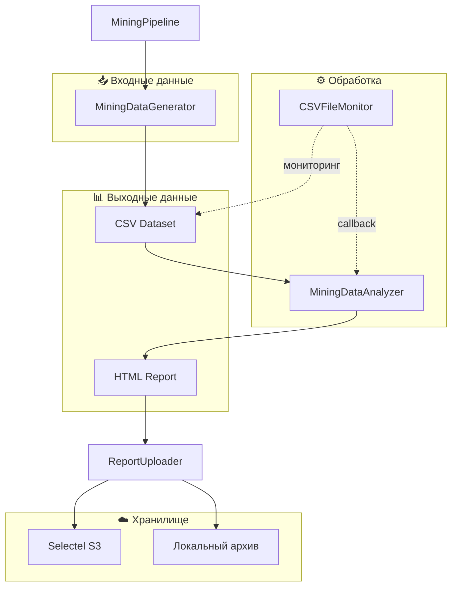
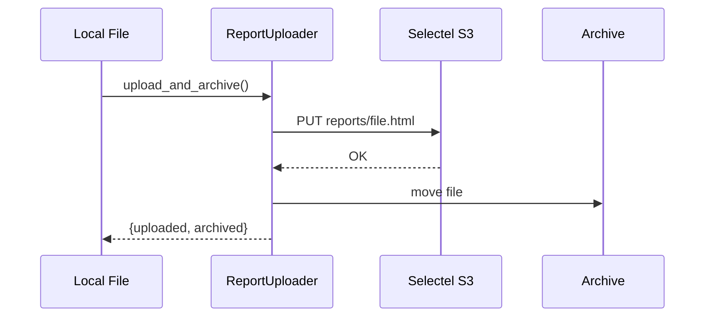
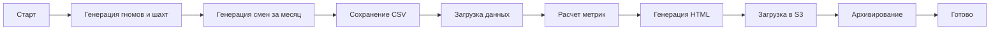
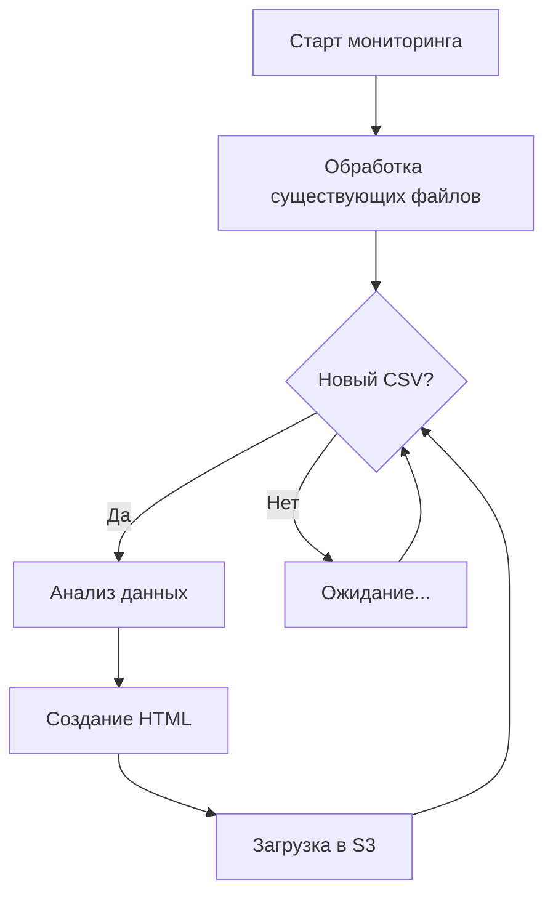

# 🏆 Mining Pipeline — Система анализа добычи золота гномами

[](https://www.python.org/downloads/)
[](https://selectel.ru/services/cloud/storage/)
[](https://github.com/aio-libs/aiobotocore)

> **Data Engineering проект** для генерации, анализа и визуализации данных о добыче золота в сказочных шахтах гномов. Включает полный ETL-пайплайн с загрузкой отчетов в облачное хранилище Selectel S3.

---

## 📋 Содержание

- [🎯 Описание проекта](#-описание-проекта)
- [🏗️ Архитектура](#️-архитектура)
- [📁 Структура проекта](#-структура-проекта)
- [⚙️ Установка и настройка](#️-установка-и-настройка)
- [🚀 Запуск](#-запуск)
- [📦 Модули](#-модули)
  - [pipeline.py — MiningPipeline](#pipelinepy--miningpipeline)
  - [data_generation.py — MiningDataGenerator](#data_generationpy--miningdatagenerator)
  - [analysis_report.py — MiningDataAnalyzer](#analysis_reportpy--miningdataanalyzer)
  - [async_s3_client.py — AsyncObjectStorage](#async_s3_clientpy--asyncobjectstorage)
  - [monitoring.py — CSVFileMonitor](#monitoringpy--csvfilemonitor)
  - [report_uploader.py — ReportUploader](#report_uploaderpy--reportuploader)
  - [config.py — Конфигурация S3](#configpy--конфигурация-s3)
- [🔄 Workflow пайплайна](#-workflow-пайплайна)
- [📊 Формат данных](#-формат-данных)
- [🎨 HTML-отчет](#-html-отчет)
- [☁️ Интеграция с Selectel S3](#️-интеграция-с-selectel-s3)
- [🔧 Разработка и OOP-паттерны](#-разработка-и-oop-паттерны)
- [📝 Логирование](#-логирование)
- [📄 Лицензия](#-лицензия)

---

## 🎯 Описание проекта

Mining Pipeline — это полнофункциональная система для работы с данными о добыче золота в фантастическом мире гномов. Проект демонстрирует навыки Data Engineering:

### Ключевые возможности:

| Функция | Описание |
|---------|----------|
| **Генерация данных** | Создание реалистичного датасета с 500+ гномами и 20+ шахтами |
| **Анализ данных** | Расчет KPI, рейтингов, эффективности смен |
| **HTML-отчеты** | Красивые интерактивные отчеты с адаптивным дизайном |
| **Облачное хранилище** | Асинхронная загрузка в Selectel S3 |
| **Мониторинг файлов** | Автоматическая обработка новых CSV-файлов |
| **Архивирование** | Локальное архивирование обработанных отчетов |

---

## 🏗️ Архитектура



### Компоненты системы:

| Компонент | Класс | Роль |
|-----------|-------|------|
| **Оркестратор** | `MiningPipeline` | Управление всем ETL-процессом |
| **Генератор** | `MiningDataGenerator` | Создание синтетических данных |
| **Анализатор** | `MiningDataAnalyzer` | Расчет метрик и создание отчетов |
| **S3-клиент** | `AsyncObjectStorage` | Базовые операции с S3 |
| **Загрузчик** | `ReportUploader` | Загрузка и архивирование отчетов |
| **Монитор** | `CSVFileMonitor` | Отслеживание новых файлов |

---

## 📁 Структура проекта

```
de-internship-selectel/
├── 📄 pipeline.py           # Главный оркестратор пайплайна
├── 📄 data_generation.py    # Генератор синтетических данных
├── 📄 analysis_report.py    # Анализатор данных и генератор отчетов
├── 📄 async_s3_client.py    # Асинхронный клиент S3
├── 📄 monitoring.py         # Мониторинг файловой системы
├── 📄 report_uploader.py    # Загрузчик отчетов в S3
├── 📄 config.py             # Конфигурация S3
├── 📄 requirements.txt      # Python зависимости
├── 📄 .env                  # Переменные окружения (секреты)
├── 📄 .gitignore            # Исключения Git
│
├── 📁 data/                 # CSV-файлы с данными
│   └── mining_data_YYYY_MM.csv
│
├── 📁 reports/              # HTML-отчеты (временно)
│   └── mining_report_Month_YYYY.html
│
├── 📁 archive/              # Архив обработанных отчетов
│   └── mining_report_Month_YYYY.html
│
└── 📁 logs/                 # Логи операций загрузки
    └── upload_YYYY-MM-DD.log
```

---

## ⚙️ Установка и настройка

### 1. Клонирование репозитория

```bash
git clone <repository-url>
cd de-internship-selectel
```

### 2. Создание виртуального окружения

```bash
python -m venv .venv

# Windows
.venv\Scripts\activate

# Linux/macOS
source .venv/bin/activate
```

### 3. Установка зависимостей

```bash
pip install -r requirements.txt
```

### 4. Настройка переменных окружения

Создайте файл `.env` в корне проекта:

```ini
# S3 Configuration
S3_ACCESS_KEY=your_access_key_here
S3_SECRET_KEY=your_secret_key_here
S3_ENDPOINT=https://s3.ru-7.storage.selcloud.ru
S3_BUCKET=your_bucket_name
```

> ⚠️ **Важно:** Никогда не коммитьте файл `.env` с реальными ключами в репозиторий!

### Зависимости проекта

| Пакет | Версия | Назначение |
|-------|--------|------------|
| `aiobotocore` | ≥2.5.0 | Асинхронный клиент AWS S3 |
| `botocore` | ≥1.29.0 | Базовый клиент AWS |
| `pandas` | ≥2.0.0 | Обработка данных |
| `numpy` | ≥1.24.0 | Численные вычисления |
| `faker` | ≥18.0.0 | Генерация fake-данных |
| `watchdog` | ≥3.0.0 | Мониторинг файловой системы |
| `python-dotenv` | ≥1.0.0 | Загрузка переменных окружения |

---

## 🚀 Запуск

### Однократный запуск полного цикла

```bash
python pipeline.py
```

Выполняет:
1. Генерацию данных за последний месяц
2. Анализ и создание HTML-отчета
3. Загрузку отчета в Selectel S3
4. Архивирование локального файла

### Режим мониторинга

```bash
python pipeline.py --monitor
```

Запускает непрерывный мониторинг папки `data/`:
- Обрабатывает существующие CSV-файлы
- Следит за появлением новых файлов
- Автоматически создает отчеты и загружает их

### Отдельные модули

```bash
# Только генерация данных
python data_generation.py

# Только анализ и отчет
python analysis_report.py
```

---

## 📦 Модули

### pipeline.py — MiningPipeline

**Главный оркестратор** всего ETL-процесса.

```python
class MiningPipeline:
    """
    Управляет полным циклом обработки данных
    
    Режимы работы:
    - run_once(): Однократный запуск (генерация -> анализ -> загрузка)
    - run_with_monitoring(): Запуск с мониторингом папки data
    """
```

#### Методы:

| Метод | Описание | Возвращает |
|-------|----------|------------|
| `__init__(data_dir, reports_dir)` | Инициализация с указанием папок | — |
| `generate_data(num_gnomes, num_mines)` | Генерация CSV-датасета | `str` — путь к файлу |
| `analyze_and_create_report(csv_path)` | Анализ и создание HTML | `str` — путь к отчету |
| `upload_to_storage(report_path)` | Асинхронная загрузка в S3 | `dict` — результат |
| `run_once(num_gnomes, num_mines)` | Полный однократный цикл | `dict` — результаты |
| `run_with_monitoring()` | Запуск с мониторингом | — |

#### Пример использования:

```python
from pipeline import MiningPipeline

pipeline = MiningPipeline(data_dir="data", reports_dir="reports")

# Однократный запуск
result = pipeline.run_once(num_gnomes=500, num_mines=20)
print(f"CSV: {result['csv_path']}")
print(f"Отчет: {result['report_path']}")
print(f"Загружен: {result['upload_result']['uploaded']}")
```

---

### data_generation.py — MiningDataGenerator

**Генератор синтетических данных** о добыче золота.

```python
class MiningDataGenerator:
    """
    Генерирует реалистичный датасет смен гномов за календарный месяц
    
    Особенности:
    - Уникальные имена гномов с фэнтези-стилем
    - Разнообразные названия шахт (включая легендарные)
    - Распределение продуктивности (супер-продуктивные, ленивые, обычные)
    - Случайные события (обвалы, богатые жилы, поломки)
    - Качество руды (богатая, средняя, бедная)
    """
```

#### Ключевые методы:

| Метод | Описание |
|-------|----------|
| `generate_gnomes(count)` | Генерация списка уникальных гномов |
| `generate_mines(count)` | Генерация списка шахт |
| `get_last_calendar_month()` | Получение периода последнего месяца |
| `calculate_gold_amount(...)` | Расчет добычи с учетом всех факторов |
| `generate_shifts_for_month(...)` | Генерация всех смен за месяц |
| `save_to_csv(df, filename)` | Сохранение в CSV |
| `generate_dataset(num_gnomes, num_mines)` | Полный цикл генерации |

#### Алгоритм расчета добычи:

```python
# Итоговая добыча = базовая * множители
gold = base_gold_per_hour * shift_duration * (
    gnome_multiplier *      # Продуктивность гнома (0.1-3.5)
    mine_multiplier *       # Богатство шахты (0.5-3.5)
    day_factor *            # Усталость к концу месяца (0.8-1.1)
    event_multiplier *      # Случайные события (0.1-4.0)
    quality_multiplier      # Качество руды (0.1-2.0)
)
```

#### Распределение продуктивности гномов:

| Тип | Вероятность | Множитель | Трудовая этика |
|-----|-------------|-----------|----------------|
| Супер-продуктивные | 5% | 2.0-3.5 | 0.8-1.0 |
| Ленивые | 10% | 0.1-0.6 | 0.1-0.4 |
| Обычные | 85% | 0.7-1.8 | 0.5-0.9 |

---

### analysis_report.py — MiningDataAnalyzer

**Анализатор данных** с генерацией красивых HTML-отчетов.

```python
class MiningDataAnalyzer:
    """
    Анализирует датасет и создает интерактивный HTML-отчет
    
    Рассчитываемые метрики:
    - Общая добыча и количество смен
    - Средняя/максимальная/минимальная добыча
    - Эффективность (золото/час)
    - Рейтинги гномов и шахт
    - Распределение по дням недели
    """
```

#### Ключевые методы:

| Метод | Описание |
|-------|----------|
| `load_data(filepath)` | Загрузка CSV-файла |
| `find_latest_dataset()` | Поиск последнего датасета |
| `calculate_metrics()` | Расчет всех метрик |
| `generate_html_report()` | Генерация HTML-отчета |
| `analyze_and_report(data_path)` | Полный цикл анализа |

#### Рассчитываемые метрики:

```python
metrics = {
    'total_shifts': int,          # Всего смен
    'unique_gnomes': int,         # Уникальных гномов
    'unique_mines': int,          # Уникальных шахт
    'total_gold': int,            # Общая добыча
    'avg_gold_per_shift': float,  # Средняя добыча за смену
    'max_gold_per_shift': int,    # Рекордная добыча
    'min_gold_per_shift': int,    # Минимальная добыча
    'avg_efficiency': float,      # Средняя эффективность
    'avg_shift_duration': float,  # Средняя длительность смены
    'most_productive_gnome': str, # Стахановец месяца
    'most_efficient_mine': str,   # Лучшая шахта
    'best_day': str,              # Лучший день недели
    'lazy_gnomes': dict,          # Топ-5 ленивых
}
```

---

### async_s3_client.py — AsyncObjectStorage

**Базовый асинхронный клиент** для работы с S3-совместимым хранилищем.

```python
class AsyncObjectStorage:
    """
    Асинхронный клиент для работы с объектным хранилищем S3
    
    Использует aiobotocore для неблокирующих операций
    """
```

#### Методы:

| Метод | Описание | Async |
|-------|----------|-------|
| `send_file(local_source)` | Загрузка файла в бакет | ✅ |
| `fetch_file(remote_name, local_target)` | Скачивание файла | ✅ |
| `remove_file(remote_name)` | Удаление файла | ✅ |
| `file_exists(remote_name)` | Проверка существования | ✅ |
| `list_files(prefix)` | Список файлов в бакете | ✅ |

#### Пример использования:

```python
import asyncio
from async_s3_client import AsyncObjectStorage

async def main():
    storage = AsyncObjectStorage(
        key_id="access_key",
        secret="secret_key",
        endpoint="https://s3.ru-7.storage.selcloud.ru",
        container="my-bucket"
    )
    
    # Загрузка файла
    await storage.send_file("local_file.txt")
    
    # Проверка существования
    exists = await storage.file_exists("local_file.txt")
    
    # Получение списка файлов
    files = await storage.list_files(prefix="reports/")

asyncio.run(main())
```

---

### monitoring.py — CSVFileMonitor

**Монитор файловой системы** для отслеживания новых CSV-файлов.

```python
class CSVFileMonitor:
    """
    Монитор для отслеживания CSV файлов в указанной папке
    
    Использует библиотеку watchdog для событий файловой системы
    Поддерживает callback-функции для обработки файлов
    """
```

#### Методы:

| Метод | Описание |
|-------|----------|
| `__init__(watch_dir, on_new_file_callback)` | Инициализация с callback |
| `process_existing_files()` | Обработка существующих файлов |
| `start(process_existing)` | Запуск мониторинга |
| `stop()` | Остановка мониторинга |
| `run_forever(process_existing)` | Бесконечный цикл |

#### Пример использования:

```python
from monitoring import CSVFileMonitor

def process_file(filepath: str):
    print(f"Обнаружен новый файл: {filepath}")
    # Обработка файла...

monitor = CSVFileMonitor("data", process_file)
monitor.run_forever()  # Ctrl+C для остановки
```

---

### report_uploader.py — ReportUploader

**Загрузчик отчетов** в S3 с архивированием.

```python
class ReportUploader:
    """
    Асинхронный загрузчик отчетов в S3 хранилище
    
    Функциональность:
    - Загрузка файлов в папку reports/ в S3
    - Перемещение локальных файлов в archive/
    - Детальное логирование в папку logs/
    """
```

#### Методы:

| Метод | Описание | Async |
|-------|----------|-------|
| `upload_report(local_path, remote_folder)` | Загрузка в S3 | ✅ |
| `move_to_local_archive(local_path, archive_folder)` | Архивирование | ❌ |
| `upload_and_archive(local_path)` | Полный цикл | ✅ |

#### Workflow загрузки:



---

### config.py — Конфигурация S3

**Модуль конфигурации** для загрузки настроек S3.

```python
from dotenv import load_dotenv

load_dotenv()

S3_CONFIG = {
    'ACCESS_KEY': os.getenv('S3_ACCESS_KEY'),
    'SECRET_KEY': os.getenv('S3_SECRET_KEY'),
    'ENDPOINT': os.getenv('S3_ENDPOINT', 'https://s3.ru-7.storage.selcloud.ru'),
    'BUCKET': os.getenv('S3_BUCKET', 'de-internship-practice')
}
```

---

## 🔄 Workflow пайплайна

### Однократный запуск (`run_once`)



### Режим мониторинга (`run_with_monitoring`)



---

## 📊 Формат данных

### CSV-датасет

Генерируемый файл `mining_data_YYYY_MM.csv` содержит следующие колонки:

| Колонка | Тип | Описание |
|---------|-----|----------|
| `gnome_id` | int | ID гнома |
| `gnome_name` | str | Имя гнома (например, "Торин Каменная Борода") |
| `gnome_experience` | int | Опыт гнома (1-100) |
| `mine_id` | int | ID шахты |
| `mine_name` | str | Название шахты |
| `gold_amount` | int | Добытое золото |
| `shift_duration_hours` | float | Длительность смены в часах |
| `shift_duration_formatted` | str | Форматированная длительность ("7ч 30м") |
| `shift_date` | date | Дата смены |
| `shift_day` | str | День недели (на английском) |
| `shift_start_time` | str | Время начала ("08:30") |
| `shift_end_time` | str | Время окончания ("16:00") |
| `shift_type` | str | Тип смены (утренняя/дневная/ночная) |
| `event_in_mine` | str | Событие ("Без событий", "Обвал", "Богатая жила") |
| `ore_quality` | str | Качество руды ("Богатая", "Средняя", "Бедная") |
| `haul_type` | str | Тип добычи ("Феноменальная", "Хорошая", "Слабая") |
| `efficiency_gold_per_hour` | float | Эффективность (золото/час) |
| `month` | str | Месяц (на английском) |
| `year` | int | Год |
| `shift_number` | int | Номер смены гнома |

### Пример данных:

```csv
gnome_id,gnome_name,gold_amount,shift_date,mine_name,ore_quality
1,Торин Каменная Борода,156,2024-11-15,Мория,Богатая
2,Балин Железный Кулак,42,2024-11-15,Эребор,Средняя
3,Гимли Златобородый,8,2024-11-15,Старые Копи,Бедная
```

---

## 🎨 HTML-отчет

### Структура отчета

Генерируемый HTML-отчет включает:

1. **Шапка**
   - Название отчета
   - Период (месяц и год)

2. **Сводные карточки**
   - Общая добыча золота
   - Количество смен
   - Средняя добыча за смену
   - Количество гномов
   - Стахановец месяца
   - Лучшая шахта

3. **Ключевые показатели**
   - Эффективность (золота/час)
   - Средняя длительность смены
   - Рекордная добыча
   - Лучший день недели

4. **Рейтинги**
   - Топ-5 продуктивных гномов
   - Топ-5 продуктивных шахт
   - Доска позора (5 ленивых гномов)

### Особенности дизайна:

- ✅ Адаптивный дизайн (mobile-first)
- ✅ Градиенты и тени
- ✅ Hover-эффекты на карточках
- ✅ Emoji для визуального разнообразия
- ✅ Цветовые акценты для важных метрик

---

## ☁️ Интеграция с Selectel S3

### Структура в бакете

```
de-internship-practice/
└── reports/
    ├── mining_report_November_2024.html
    ├── mining_report_December_2024.html
    └── ...
```

### Асинхронное подключение

Проект использует `aiobotocore` для неблокирующих операций с S3:

```python
from aiobotocore.session import get_session

@asynccontextmanager
async def _connect(self):
    async with self._session.create_client("s3", **self._auth) as connection:
        yield connection
```

### Обработка ошибок

Все операции с S3 обрабатывают типичные ошибки:

| Ошибка | Описание | Обработка |
|--------|----------|-----------|
| `NoSuchKey` | Файл не найден | Логирование, возврат False |
| `NoSuchBucket` | Бакет не существует | Логирование, исключение |
| `AccessDenied` | Доступ запрещен | Логирование, исключение |
| `FileNotFoundError` | Локальный файл не найден | Логирование, исключение |

---

## 🔧 Разработка и OOP-паттерны

### Применяемые паттерны

| Паттерн | Реализация |
|---------|------------|
| **Facade** | `MiningPipeline` скрывает сложность подсистем |
| **Template Method** | `analyze_and_report()` определяет скелет алгоритма |
| **Strategy** | Callback-функции в `CSVFileMonitor` |
| **Factory Method** | `_create_handler()` создает обработчики событий |
| **Dependency Injection** | Передача конфигурации через конструкторы |

### SOLID-принципы

- **S** — Каждый класс отвечает за одну задачу
- **O** — Классы открыты для расширения (callbacks)
- **L** — Подклассы не нарушают контракты (не применимо напрямую)
- **I** — Узкие интерфейсы (методы делают одно дело)
- **D** — Зависимость от абстракций (config, callbacks)

### Асинхронное программирование

```python
# Контекстный менеджер для асинхронных подключений
@asynccontextmanager
async def _connect(self):
    async with self._session.create_client("s3", **self._auth) as connection:
        yield connection

# Использование в методах
async with self._connect() as client:
    await client.put_object(Bucket=self._bucket, Key=key, Body=data)
```

---

## 📝 Логирование

### Структура логов

Проект использует иерархическое логирование:

```
Pipeline Logger
├── data_generation Logger
├── analysis_report Logger
├── monitoring Logger
└── ReportUploader Logger (с файловым выводом)
```

### Файлы логов

```
logs/
└── upload_2024-12-09.log
```

### Формат записей:

```
2024-12-09 14:30:15 - INFO - Начинаю загрузку: report.html -> reports/report.html
2024-12-09 14:30:17 - INFO - ✅ Файл успешно загружен: reports/report.html
2024-12-09 14:30:17 - INFO - Перемещаю в локальный архив: reports/report.html -> archive/report.html
```

---

## 📄 Лицензия

MIT License © 2024

---

## 👨‍💻 Автор

Проект создан в рамках стажировки по Data Engineering в Selectel.

---

> **Совет:** Для просмотра HTML-отчетов откройте файл в браузере или используйте расширение Live Server в VS Code.
