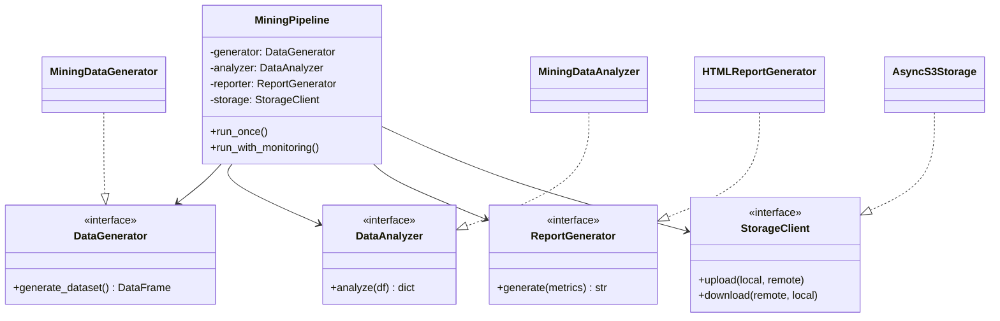

# 📋 Аудит SOLID-принципов: Mining Pipeline

> **Дата анализа:** 11 декабря 2025  
> **Проект:** de-internship-selectel  
> **Количество модулей:** 7

---

## 📊 Общая оценка

| Принцип | Оценка | Комментарий |
|---------|--------|-------------|
| **S** — Single Responsibility | ⭐⭐⭐⭐ | Хорошо, но есть нарушения |
| **O** — Open/Closed | ⭐⭐⭐ | Средне, нужны доработки |
| **L** — Liskov Substitution | ⭐⭐⭐⭐ | Хорошо (где применимо) |
| **I** — Interface Segregation | ⭐⭐⭐ | Средне, интерфейсы не используются |
| **D** — Dependency Inversion | ⭐⭐⭐ | Средне, есть жёсткие зависимости |

---

## **S — Single Responsibility Principle**
> *Класс должен иметь только одну причину для изменения*

### ✅ Соответствует

| Класс | Ответственность |
|-------|-----------------|
| `AsyncObjectStorage` | Только операции с S3 хранилищем |
| `CSVFileMonitor` | Только мониторинг файловой системы |
| `MiningDataGenerator` | Только генерация синтетических данных |

### ⚠️ Нарушения

#### 1. `MiningDataAnalyzer` — несколько ответственностей

```python
# analysis_report.py

class MiningDataAnalyzer:
    def load_data(...)           # 1. Загрузка данных
    def calculate_metrics(...)   # 2. Расчёт метрик
    def generate_html_report(...) # 3. Генерация HTML (!)
    def _upload_to_storage(...)  # 4. Загрузка в S3 (!!)
    def _open_report_in_browser(...) # 5. Открытие браузера (!!)
```

**Проблема:** Класс выполняет 5 разных задач:
- Загрузка данных
- Анализ данных
- Генерация HTML-отчётов
- Загрузка в облачное хранилище
- Управление браузером

**Рекомендации:**
```python
# Разделить на отдельные классы:

class DataLoader:
    """Загрузка данных из CSV"""
    def load(self, filepath: str) -> pd.DataFrame
    def find_latest(self, directory: str) -> str

class MetricsCalculator:
    """Расчёт метрик"""
    def calculate(self, df: pd.DataFrame) -> dict

class HTMLReportGenerator:
    """Генерация HTML-отчётов"""
    def generate(self, metrics: dict, df: pd.DataFrame) -> str
    def save(self, html: str, filepath: str)
```

---

#### 2. `ReportUploader` — логирование внутри класса

```python
# report_uploader.py

class ReportUploader:
    def _setup_logging(self):  # Настройка логирования — не его ответственность!
        os.makedirs(self._logs_dir, exist_ok=True)
        log_filename = f"upload_{datetime.now()...}.log"
        # ... много кода настройки логгера
```

**Рекомендация:** Настройку логирования вынести во внешний модуль или использовать стандартную конфигурацию.

---

#### 3. `MiningDataGenerator` — смешанная логика

```python
# data_generation.py

class MiningDataGenerator:
    def generate_gnomes(...)  # Генерация имён
    def generate_mines(...)   # Генерация шахт
    def calculate_gold_amount(...)  # Бизнес-логика расчёта золота (!)
    def save_to_csv(...)      # Сохранение в файл (!)
```

**Рекомендация:** Вынести:
- `save_to_csv` → отдельный модуль/класс `DataExporter`
- `calculate_gold_amount` → отдельный класс `GoldCalculator`

---

## **O — Open/Closed Principle**
> *Открыт для расширения, закрыт для модификации*

### ✅ Соответствует

| Компонент | Как достигается |
|-----------|-----------------|
| `CSVFileMonitor` | Callback-функция для обработки файлов |
| `MiningPipeline` | Методы можно переопределить в подклассах |

```python
# monitoring.py — хороший пример

class CSVFileMonitor:
    def __init__(self, watch_dir: str, on_new_file_callback: Callable):
        self.callback = on_new_file_callback  # ✅ Стратегия через callback
```

### ⚠️ Нарушения

#### 1. Жёстко закодированный HTML-шаблон

```python
# analysis_report.py

def generate_html_report(self) -> str:
    html_content = f"""
    <!DOCTYPE html>
    <html>
    ...400+ строк HTML...
    </html>
    """  # ❌ Для изменения дизайна нужно менять код класса
```

**Рекомендации:**
```python
# Вариант 1: Использовать шаблонизатор
from jinja2 import Template

class HTMLReportGenerator:
    def __init__(self, template_path: str = "templates/report.html"):
        self.template = Template(open(template_path).read())
    
    def generate(self, metrics: dict) -> str:
        return self.template.render(**metrics)

# Вариант 2: Dependency Injection
class HTMLReportGenerator:
    def __init__(self, template_engine: TemplateEngine):
        self.engine = template_engine
```

---

#### 2. Жёстко закодированные параметры генерации

```python
# data_generation.py

prefixes = ['Торин', 'Балин', 'Двалин', ...]  # ❌ Внутри класса
suffixes = ['Каменная Борода', ...]           # ❌ Нельзя расширить без изменения кода
```

**Рекомендация:**
```python
class MiningDataGenerator:
    def __init__(self, 
                 name_prefixes: list[str] = None,
                 name_suffixes: list[str] = None,
                 mine_templates: list[str] = None):
        self.prefixes = name_prefixes or DEFAULT_PREFIXES
        self.suffixes = name_suffixes or DEFAULT_SUFFIXES
```

---

#### 3. Фиксированные пути к директориям

```python
# Везде в коде:
data_dir = 'data'       # ❌
reports_dir = 'reports' # ❌
archive_dir = 'archive' # ❌
```

**Рекомендация:** Все пути передавать через конфигурацию или конструктор.

---

## **L — Liskov Substitution Principle**
> *Подтипы должны быть взаимозаменяемы с базовыми типами*

### ✅ Соответствует

В проекте **нет явной иерархии наследования**, поэтому принцип LSP применим ограниченно.

Единственное место с наследованием:

```python
# monitoring.py

class Handler(FileSystemEventHandler):  # ✅ Корректно расширяет базовый класс
    def on_created(self, event):
        ...
    def on_modified(self, event):
        ...
```

### 💡 Возможности для улучшения

Можно создать базовый абстрактный класс для хранилища:

```python
from abc import ABC, abstractmethod

class StorageClient(ABC):
    @abstractmethod
    async def upload(self, local_path: str, remote_path: str): pass
    
    @abstractmethod
    async def download(self, remote_path: str, local_path: str): pass
    
    @abstractmethod
    async def delete(self, remote_path: str): pass
    
    @abstractmethod
    async def exists(self, remote_path: str) -> bool: pass

class AsyncS3Storage(StorageClient):
    """Реализация для Selectel S3"""
    ...

class LocalFileStorage(StorageClient):
    """Реализация для локальной ФС (для тестов)"""
    ...
```

---

## **I — Interface Segregation Principle**
> *Клиенты не должны зависеть от интерфейсов, которые они не используют*

### ⚠️ Проблемы

#### 1. Отсутствие абстрактных интерфейсов

В Python-проекте **отсутствуют явные интерфейсы** (Protocol/ABC):

```python
# Нет определения интерфейсов
# Все классы concrete-классы
```

**Рекомендации:**

```python
from typing import Protocol

class DataGenerator(Protocol):
    """Интерфейс генератора данных"""
    def generate_dataset(self, **kwargs) -> pd.DataFrame: ...
    def save_to_csv(self, df: pd.DataFrame, filename: str) -> str: ...

class DataAnalyzer(Protocol):
    """Интерфейс анализатора"""
    def load_data(self, filepath: str) -> bool: ...
    def calculate_metrics(self) -> dict: ...

class ReportGenerator(Protocol):
    """Интерфейс генератора отчётов"""
    def generate(self, metrics: dict) -> str: ...
    def save(self, content: str, filepath: str) -> str: ...
```

---

#### 2. `MiningDataAnalyzer` — слишком много методов

Класс `MiningDataAnalyzer` имеет 13+ публичных методов. Клиенты вынуждены зависеть от всего интерфейса.

**Рекомендация:** Разделить на несколько интерфейсов:

```python
class Loadable(Protocol):
    def load_data(self, filepath: str) -> bool: ...

class Analyzable(Protocol):
    def calculate_metrics(self) -> dict: ...

class Reportable(Protocol):
    def generate_html_report(self) -> str: ...
```

---

## **D — Dependency Inversion Principle**
> *Модули верхнего уровня не должны зависеть от модулей нижнего уровня*

### ✅ Соответствует

#### 1. `config.py` — внешняя конфигурация

```python
# config.py
S3_CONFIG = {
    'ACCESS_KEY': os.getenv('S3_ACCESS_KEY'),
    'SECRET_KEY': os.getenv('S3_SECRET_KEY'),
    ...
}
```

Конфигурация загружается из переменных окружения — ✅ правильно.

---

#### 2. Callback в `CSVFileMonitor`

```python
# Инверсия управления через callback
monitor = CSVFileMonitor("data", callback_func)
```

---

### ⚠️ Нарушения

#### 1. Жёсткие импорты внутри методов

```python
# pipeline.py

def generate_data(self, ...):
    from data_generation import MiningDataGenerator  # ❌ Жёсткая зависимость
    generator = MiningDataGenerator()

def analyze_and_create_report(self, ...):
    from analysis_report import MiningDataAnalyzer  # ❌ Жёсткая зависимость
```

**Рекомендация — Dependency Injection:**

```python
class MiningPipeline:
    def __init__(
        self,
        data_generator: DataGenerator = None,
        data_analyzer: DataAnalyzer = None,
        report_uploader: ReportUploader = None,
        data_dir: str = "data",
        reports_dir: str = "reports"
    ):
        self.generator = data_generator or MiningDataGenerator()
        self.analyzer = data_analyzer or MiningDataAnalyzer()
        self.uploader = report_uploader or self._create_default_uploader()
```

---

#### 2. Прямая зависимость от конкретных классов

```python
# analysis_report.py

def _upload_to_storage(self, report_path: str):
    from report_uploader import upload_report_to_storage  # ❌ Зависимость от конкретной реализации
    result = asyncio.run(upload_report_to_storage(report_path))
```

**Рекомендация:**

```python
class MiningDataAnalyzer:
    def __init__(self, uploader: StorageClient = None):
        self.uploader = uploader  # ✅ Инъекция зависимости
    
    async def _upload_to_storage(self, report_path: str):
        if self.uploader:
            await self.uploader.upload(report_path, f"reports/{Path(report_path).name}")
```

---

#### 3. `ReportUploader` зависит от `config.py`

```python
# report_uploader.py

async def upload_report_to_storage(report_path: str):
    from config import S3_CONFIG  # ❌ Прямая зависимость от модуля config
    
    uploader = ReportUploader(
        key_id=S3_CONFIG['ACCESS_KEY'],
        ...
    )
```

**Рекомендация:** Передавать конфигурацию явно через параметры.

---

## 📋 Сводная таблица рекомендаций

| Приоритет | Принцип | Проблема | Рекомендация |
|-----------|---------|----------|--------------|
| 🔴 Высокий | S | `MiningDataAnalyzer` делает 5 разных вещей | Разделить на `DataLoader`, `MetricsCalculator`, `ReportGenerator` |
| 🔴 Высокий | D | Жёсткие импорты в `MiningPipeline` | Использовать Dependency Injection |
| 🟡 Средний | O | HTML-шаблон захардкожен | Вынести в отдельный файл или использовать Jinja2 |
| 🟡 Средний | O | Списки имён внутри класса | Вынести в конфигурацию/параметры |
| 🟡 Средний | I | Нет абстрактных интерфейсов | Добавить Protocol/ABC для ключевых компонентов |
| 🟢 Низкий | S | `save_to_csv` в `MiningDataGenerator` | Вынести в отдельный `DataExporter` |
| 🟢 Низкий | L | Нет базовых абстракций для Storage | Создать `StorageClient` ABC |

---

## 🎯 Рекомендуемая архитектура



---

## ✅ Что уже хорошо

1. **Модульная структура** — код разделён на отдельные файлы
2. **Единообразное логирование** — везде используется `logging`
3. **Асинхронность** — корректное использование `async/await`
4. **Конфигурация** — секреты в `.env` файле
5. **Callback-паттерн** — в `CSVFileMonitor`
6. **Документация** — docstrings во всех классах
7. **Type hints** — аннотации типов в большинстве методов

---

> **Вывод:** Проект имеет хорошую базовую структуру, но для полного соответствия SOLID требуется рефакторинг с разделением ответственностей и внедрением интерфейсов/Dependency Injection.
