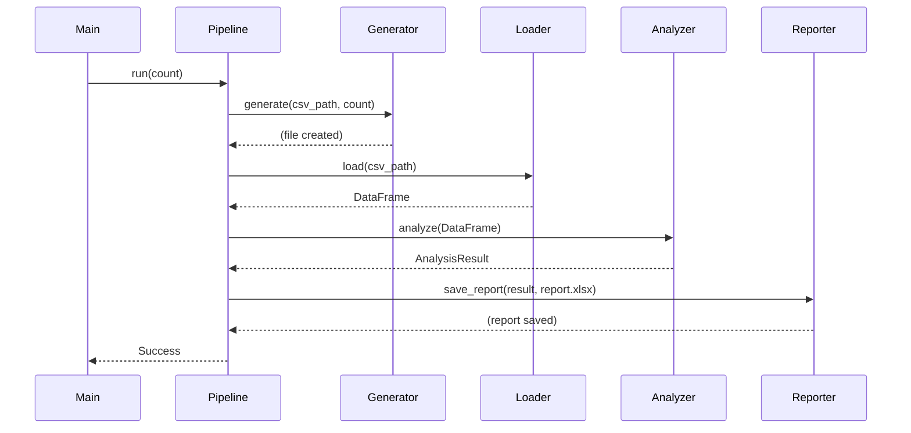
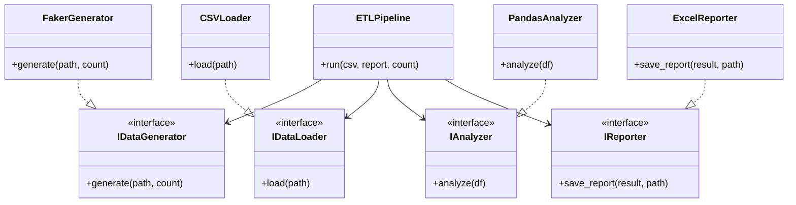

# Employee Data Pipeline

## Описание Проекта
Простой, но мощный ETL-пайплайн для генерации, обработки и анализа синтетических данных о сотрудниках. Этот проект служит эталонной реализацией production-grade приложения на Python, следующего современным лучшим практикам и принципам SOLID.

## Функциональность
- **Генерация Данных (Generate)**: масштабируемая генерация синтетических данных с использованием `Faker`.
- **ETL Процесс**: Валидация, загрузка, проверка качества и трансформация данных.
- **Анализ (Analyze)**: Расчет ключевых HR-метрик (статистика по зарплатам, удержание, возрастное распределение).
- **Отчетность (Report)**: Экспорт консолидированных отчетов в Excel.
- **Высокие Стандарты Качества**:
    - **100% Типобезопасность** (`mypy --strict`).
    - **Тестирование** (`pytest` с покрытием 90%+).
    - **Линтинг** (`ruff`, `codespell`).
    - **Документирование** (Google-style docstrings, Sphinx/MkDocs).

## Этапы Пайплайна
1. **Generate**: Создание `employees.csv` с синтетическими данными.
2. **Check & Load**: Проверка наличия файла и схемы, загрузка в `pandas`.
3. **Analyze**: Расчет метрик (средняя зарплата, отделы и т.д.).
4. **Report**: Сохранение результатов в `report.xlsx`.

## Архитектура (SOLID)
- **SRP**: отдельные модули для Генерации, Загрузки, Анализа, Отчетности.
- **OCP**: Интерфейсы для Источников Данных и Форматов Отчетов позволяют расширение без модификации.
- **LSP**: Подклассы `DataSource` или `ReportGenerator` взаимозаменяемы.
- **ISP**: Маленькие, специфические интерфейсы (например, `IDataLoader`, `IMetricsCalculator`).
- **DIP**: Высокоуровневый пайплайн зависит от абстракций, а не от конкретных реализаций.

## Поток Пайплайна (Sequence Diagram)

## Архитектура (Class Diagram)

## Инфраструктура
- **Управление Зависимостями**: Poetry.
- **CI/CD**: GitHub Actions (Lint, Test, Type Check).
- **Автоматизация**: Makefile для типовых задач.
