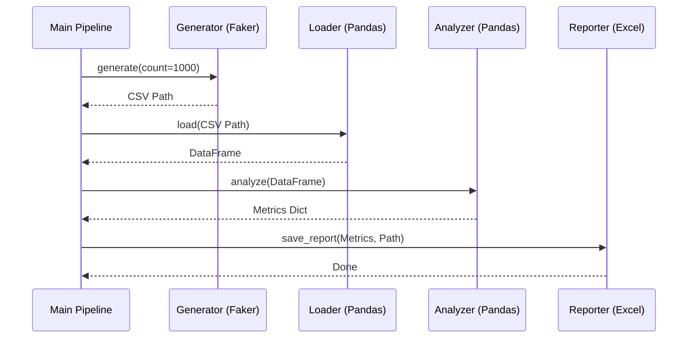

# Employee Data Pipeline


## Описание
Простой, но полноценный ETL-пайплайн для генерации, обработки и анализа синтетических данных о сотрудниках. Проект демонстрирует современные практики разработки на Python (SOLID, Type Hinting, Testing).

## Структура Проекта (Architecture)
Проект построен по модульному принципу:
- **Generate**: Генерация данных (Faker).
- **Transform**: Загрузка (Pandas) и Анализ данных.
- **Load**: Сохранение отчетов (Excel).



## Установка

1. Убедитесь, что установлен Python 3.12+ и Poetry.
2. Клонируйте репозиторий.
3. Установите зависимости:
```bash
make install
# или
poetry install
```

## Запуск
```bash
make run
# или
poetry run python -m employee_pipeline.main
```

## Тестирование и QA
Запуск тестов с проверкой покрытия:
```bash
make test
```

Линтинг и проверка типов:
```bash
make lint
```

## Технологии
- **Python 3.12**
- **Poetry**: Управление зависимостями.
- **Pandas**: Обработка данных.
- **Faker**: Генерация данных.
- **Mypy**: Статическая типизация (Strict).
- **Ruff**: Линтер и форматтер.
