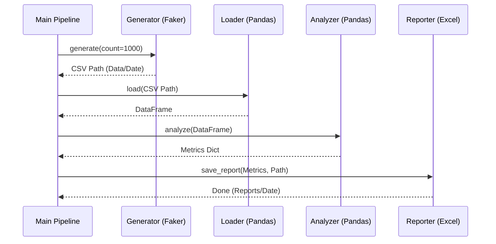

# Employee Data Pipeline


## Описание
Простой, но полноценный ETL-пайплайн для генерации, обработки и анализа синтетических данных о сотрудниках. Проект демонстрирует современные практики разработки на Python (SOLID, Type Hinting, Testing).

## Структура Проекта (Architecture)
Проект построен по модульному принципу:
- **Generate**: Генерация данных (Faker).
- **Transform**: Загрузка (Pandas) и Анализ данных.
- **Load**: Сохранение отчетов (Excel).



## Установка

1. Убедитесь, что установлен Python 3.12+ и Poetry.
2. Клонируйте репозиторий.
3. Установите зависимости:
```bash
make install
# или
poetry install
```

## Запуск
```bash
make run
# или
poetry run python -m employee_pipeline.main
```
Результаты будут сохранены в:
- `output/data/employees_YYYY-MM-DD.csv`
- `output/reports/report_YYYY-MM-DD.xlsx`

## Тестирование и QA
### Общий запуск
Все тесты с проверкой покрытия:
```bash
make test
# или
poetry run pytest --cov=employee_pipeline
```

### Запуск по модулям
Можно запускать тесты для каждого модуля отдельно:

**Domain (Models & Interfaces):**
```bash
make test-domain
# или
poetry run pytest tests/test_domain.py
```

**Generation:**
```bash
make test-generate
# или
poetry run pytest tests/test_generate.py
```

**Transformation (Load & Analyze):**
```bash
make test-transform
# или
poetry run pytest tests/test_transform.py
```

**Reporting:**
```bash
make test-load
# или
poetry run pytest tests/test_load.py
```

### Линтинг и Типы
```bash
make lint
# или
poetry run ruff check . && poetry run mypy .
```

## Документация
Сборка документации MkDocs:
```bash
make docs
```

## CI/CD
Настроен GitHub Actions workflow (`.github/workflows/ci.yml`), который автоматически запускает линтинг и тесты при пуше в `main`.

## Технологии
- **Python 3.12**
- **Poetry**
- **Pandas**
- **Faker**
- **Mypy** (Strict)
- **Ruff**
- **MkDocs / Sphinx**
